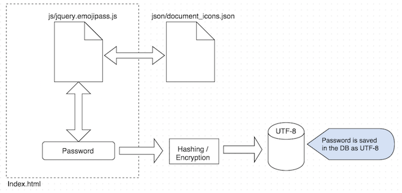
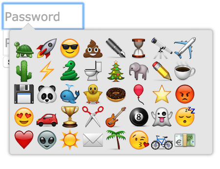
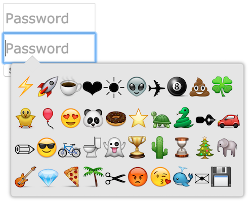
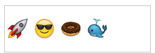

# jQuery - emojipass v1.2


Emojipass is lightweight jQuery plugin to change the way you input passwords.


## General Information

This is my first jQuery plugin, please feel free to fork the project.

#### The idea...

The general idea of this plugin is to make password input in your website a little different and at the same time bring more secure passwords for your users. 

When the user picks an image of his desire, the UTF-8 character will be input into the password field and those characters after submission will be the ones saved in the database.

Work-flow diagram:



### Table of Contents

- [Quick Start](#quick-start)
	- [Example](#example)
	- [Requirements](#requirements)
	- [Included Files](#included-files)
	- [Configuration] (#configuration)
	- [Compatibility](#compatibility)
- [Features & Releses](#features-&-releses)
	- [V1](#V1)
	- [V1.2](#V1.2)
	- [TODO](#TODO)
- [Copyright and license](#copyright-and-license)


## Quick Start

- [Download the latest release](https://github.com/ingoaguirre/jquery.emojipass/archive/master.zip).
* Clone the repo: `git clone https://github.com/ingoaguirre/jquery.emojipass.git`.

In the downloaded folder just open index.html and you will see the 2 examples of usage of jquery.emojipass.

###### Working example with the use of images:

###### Working example with the use of icon-fonts (Results may vary depending on the OS and the browser):


#### Example

Example of a password:



That will be convertend into a bunch of non readeable characters like next:

`Array ( [pass1] => 🚀😎🍩🐳)`

#### Requirements
	
jQuery - Latest version

#### What's included

Within the download you'll find the following directories and files.You'll see something like this:

```
bootstrap/
├── css/
│   └── jquery.emojipass.css
├── js/
│   ├── jquery.emojipass.js
│   ├── emoji/
│   │ 		└── 40 Icons
│   └── json/
│   		├── document_icons.json
│   		└── document_chars.json
├── images/
│   └── lock.png
├── docs/
│   └── LICENSE.txt
├── index.html  
├── submit.php
└── README.md
```
#### Configuration

```
        var settings = $.extend({
            JSONpath:'http://localhost/jquery.emojipass/js/json/', //path of the json file by default for localhost
            CSSpath : 'css/jquery.emojipass.css', //path of the css file by default
            iconsdirectory   : 'js/emoji/', //path by the fault for emoji icons
            inputpassheight : '40',
            imgsize: '33',
            popupwidth:'300px',
            popupheigth:'200px',
            useImages:true
        }, options);
```

#### Compatilibity
Tested compatibility by the moment:

- Chrome 43.0 iOS X Yosemite
  	* Works with icons
	* Works with fonts
- Firefox 40.0 Win7
 	* Works with icons
	* Works with fonts
	* <strong>[BUG]</strong> Icon-fonts not contained correctly.
- Chrome 43.0 Win7
	* Works with icons
	* Works with fonts
	* <strong>[BUG]</strong> Some icons (UTF-8) are not supported correctly.
- Internet Explorer 11 Win7
	* Works with icons
	* <strong>[BUG]</strong> Icon-fonts not contained correctly.
- Chrome 43.0 Android 4.4.2
 	* Works with icons
	* Works with fonts
- Chrome 43.0 Android 4.4.3
  	* Works with icons
	* Works with fonts
	
##Features & Releses

#### v1
* Dictionary for all the emojis and its UTF8 translation.
* Randomly shown images.
* More than one input password box.
* Close button.

#### V1.2
* Replaced dictionary from json variable into a external JSON file.
* Enable / disable use of images.
* Use native chars if images are disabled.
* Added more Emojis (40 in total now).
* Improved the popup design.
* Can close w/ ESC or focusing out of the popup.
* External css file for overriding or personalized styles.
* Added more settings configuration.


#### TODO
* Validate inputed CHARS with the JSON dictionary


##Copyright and license

Code released under the MIT license.

	


	

	
